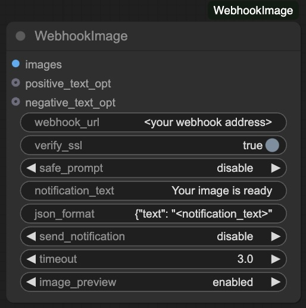

# ComfyUI WebhookImage

This package provides a custom node to ComfyUI to send a message and image by means of a webhook

## WebhookImage

Send a webhook to the specified URL. 
If you are using this on a local installation, the webhook could be generated by using ngrok https://ngrok.com/

## Further details

Will be added soon

## Installation

1. Installing the node
Navigate to your custom_nodes folder and execute

git pull https://github.com/JohanK66/ComfyUI-WebhookImage.git

2. Then run the requirements
pip install -r requirements.txt

